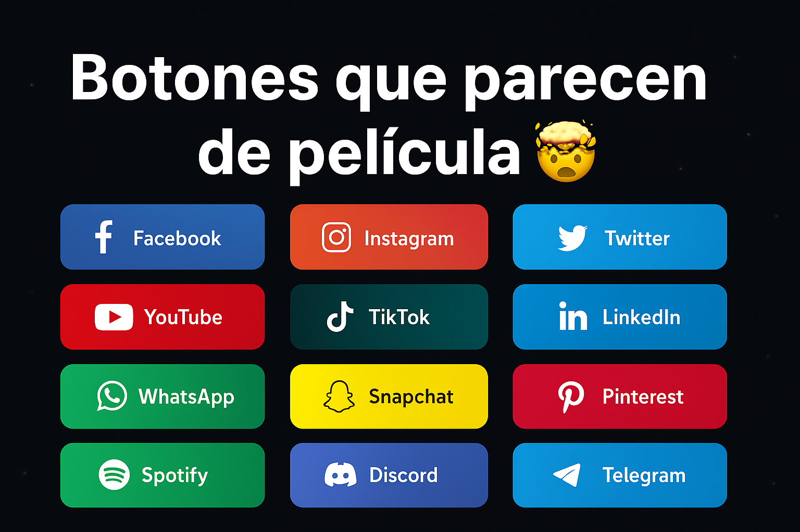

# 🎨 Botones de Redes Sociales con Animaciones

Botones animados de redes sociales creados con **HTML, CSS y JavaScript**, con efectos modernos al pasar el mouse.

---

## 🚀 Tecnologías

- HTML5
- CSS3
- JavaScript

---

## ✨ Características

- 🎨 Diseño moderno
- 💡 Animaciones suaves
- 🔗 Botones de redes sociales
- ⚡ Ligero y rápido
- 📱 Responsive

---

## 📂 Estructura del proyecto

```
botones-redes-sociales-animados/
│
├── redesSociales.html
├── style.css
├── script.js
```

---

## ▶️ Cómo usar

1. Descarga el proyecto
2. Abre `redesSociales.html` en tu navegador

---

## 📸 Vista previa



---

## 👩‍💻 Autor

Desarrollado por **She Codes MX**

⭐ Si te gustó este proyecto, deja una estrella en GitHub.
